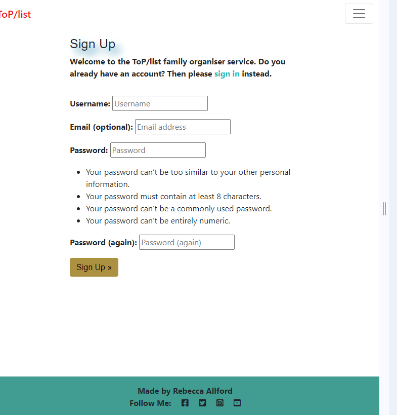

<h1 align="center">Family Organiser</h1>

This is a full-stack framework project built using Django, Python, HTML and CSS. My goal is to create a functioning and responsive website, that allows users to post tasks, comment/respond to tasks allocated to them and have an organised easy to read and understand, management system to refer to. This project has been built for the purpose of helping busy families who are looking for a task management solution, to ease their day to day lives, and assist in freeing up time to spend with their families.

# About
Family Organiser is a application where users can allocate tasks and access an organised and easy to use task management system. Many families in todays society have very busy lives, both parents may work, children have after school clubs, hobbies and social events. Its a struggle to stay organised, events, parties, or clubs can be missed causing stress and arguments. The family organiser app keeps a record of not only what tasks need to be done but also who is responsible for carrying out the task, this eliminates confusion, keeping a track of who is doing what and when. Freeing up time to enjoy other activities and removing stress and arguments .

This page is primarily targeted at busy families who are looking for a task management solution, to ease their day to day lives, but can be used by anyone who is looking for an easy use task management solution.

# Table of Contents 
1. [UX](#ux)
    - [User Stories](#user-stories)

2. [Scope](#scope)
    - [Features](#features)
    - [Future Features](#future-features)

3. [Structure](#structure)

4. [Wireframes](#wireframes)

5. [Database schema](#database-schema)

6. [Surface](#surface)

7. [Technologies Used](#technologies-used)

8. [Testing](#testing)

9. [Deployment](#deployment)

10. [Credits](#credits)

#
# UX
Using the core UX principles I first started with Strategy, thinking about the target audience & the features they would benefit from.

The target audience for 'Family Organiser' are:

- Families in todays society have very busy lives
- Anyone looking for an easy to use management system
- Parents who work long hours or who struggle due to shift work to have regular conversations about social events or childrens activities and need a tool to keep each other 
 updated.

These users will be looking for:
- An easy to use website, with tasks that are easy to read and easy-to-find 
- A website that offers a way to communicate what tasks are upcoming
- Ability to make a user account in order to interact with the site content
- Ability to allocate tasks to each other,
- Ability to communicate an update or provide a response regarding the task,
- Ability to update the allocated tasks, and a way to remove the tasks when complete.

This website will offer all of these things whilst also allowing for intuitive navigation and conformability of use.

## User Stories 

**Epic: User Registration and Authentication**
- As a new user I can register an account so that I can access and allocate tasks to the site
- As a registered user I can log in to my account so that I can update tasks I have added on the site
- As a registered user I can be confident unregistered users can not alter or delete 
  my tasks.

**Epic: Viewing Tasks**
- As a logged-in User I can view a list of tasks so that I can browse through and respond or read tasks allocated to me
- As a logged-in User I can view information about tasks so that I can see what needs doing or attending, and 
  act upon those task
- As a logged-in User I can be confident my tasks are private to myself and known registered users.

**Epic: Task Management**
- As a logged-in User I can edit tasks I have made so that I can update or amend them
- As a logged-in User I can delete tasks so that I can remove any completed or no longer relevent tasks that I 
  have posted
- As a logged-in User I can respond to tasks i have been allocated so that the author knows what has 
  been completed or why it has not

**Epic: Administrative Features**
- As a site Admin I can access the dashboard so that I can manage users that are no longer part of the families site

# Scope 
- The Family Organiser MVP aims to deliver essential features to help busy families manage their tasks and activities effectively.
  The initial version focuses on providing a streamlined and functional task management system with the following core features:

## **Features**
- User registration to allow users to create a new account with a username, email, and password.

- User login so only registered users can create tasks and allocate them to other registered users, preventing 
  anyone else editing or adding fake tasks.

- Clear easy to read tasks so users know what needs to be done.

- Clear date and name of who has allocated the task to them so user knows who has given them this task and on 
  what date.

- Clear details of who its allocated to so the person knows the task is for them.

- Visible button to remove the task so the author can delete tasks that are no longer needed or have been completed.

- Visible button to edit the task so user can update existing tasks to reflect changes or corrections.

- Respond button so allocated user’s can add details of when task was completed or why task has not 
  been completed yet.

- Display a list of all tasks in a user-friendly and organised manner.

- Show task details including title, description, date added, and assigned member.

- Order tasks by date added.

- Allow users to comment on tasks to provide updates, feedback, or responses.

- Ensure the application is fully responsive and accessible on various devices (desktop, tablet, and mobile).

- Notifications to inform user when actions have been successful or unsuccessful.

## **Non-MVP Features**
- The following features are considered out of scope for the initial sprint of the MVP but may be implemented in future versions:

- Email notification on creating a task to inform allocated family member of task.

- Adding due dates for specific tasks to assist with organisation.

- Search functionality for improved viewing of tasks.

### **Home Page**
*Navigation bar:* 
- The navigation bar appears on every page so users can easily navigate through the site
- Navigation bar has links for 'Home', 'Our Organiser' and 'Sign Up''Sign In'.
- The navbar is fully responsive, collapsing into a hamburger menu for medium and small screen size

*Hero Image:*
- The hero image welcomes the user with a short message advertising what the website is about
- The Sign In / Sign Up button will take users to the login page, if users do not have an account there is a 
  link to the Sign up page

*Our Organiser:*
- Our Organiser section shows the tasks added so users can quickly see recently entered tasks
- The Our Organiser section is fully responsive, showing a scrolling list of tasks with a section to add more
- Users can see a title, date, task details, allocated by, allocated to and number of buttons to Edit, Remove 
  and Respond.
- Responses by author will appear below the task

*Footer:*
- Appears on every page snd contains social links

### **Sign Up/sign In**
- The Sign Up / In button takes users to the Sign up page where they can also find a link to the Sign In 
  page where they can create an account

### **Response page**
- The main body of the page contains a response form, with a section for title, a short description and a date, 
  the reponse author populates automatically according to who 
  is signed in.
- only a logged in user can leave a response.

### **Future Features**
 -Task categories and filtering for improved organisation and prioritisation. 
 -To be completed by date to help organise tasks and help prioritisation.
 -Allocated user views to help allocated user organise their own tasks, improving management of those tasks.
 -Email notification to let users know when they have new tasks or when tasks they have allocated have been completed.

### **Structure**
 
Since our aim is to make this site simple and easy to use for busy families, the structure idea
for Family Organiser was to keep it simple. Simplicity helps users to quickly and easily navigate and utilise the app in a time saving manner.

The website is made from one app:
- todo

# Wireframes
All wireframes were created used [Balsamiq](https://balsamiq.com/)

Wireframes for each device are linked here:
- [Desktop](assets/documents/desktop_wireframes/)
- [Tablet](assets/documents/tablet_wireframes/)
- [Mobile](assets/documents/mobile_wireframes/)

# Database schema

## Models
### **Todo Model**

### **Respond Model**

### **User Flow Chart**

## Surface

## Design 

## Chosen Color 

 - All colours were based around Keppel

- **white** - navbar background colour fits in with the minimalist feel of the site.
- **#ac9141** - buttons colour. I choose this color because it contrasts and stands out nicely with footer .
- **white** - body site colour. Fits nicely with the rest of the page. I choose to keep this plain as it does distract from the content.
- **white** - background colour for Sign Up/Sign In forms. I choose this colour again as it keeps the focus on the form.
- **#419c91** - footer background color, adds colour without removing focus.
- **#9c415c** - Alert colour to stand out and grab users attention.
- **#419c91** - Task input form to stand out and contrast with the footer
- **419c91** - Task forms to contrast with the input box but match with the footer.
- **#df8fa7** - Tasks change to this colour when hovered over to indicate they are selected, it matches the scheme but stands out.

## Font 
- Monserat, sans-serif - main font

# Technologies Used

## Languages 
- [HTML5](https://en.wikipedia.org/wiki/HTML5)
- [CSS3](https://en.wikipedia.org/wiki/CSS)
- [Python](https://www.python.org/)

## Frameworks, Libraries & Programs Used
[GitHub](https://github.com/) - Holds the repository of my project, GitHub connects to GitPod and Heroku.

[GitPod](https://gitpod.io/workspaces) – Connected to GitHub, GitPod hosted the coding space, allowing the project to be built and then committed to the GitHub repository. 

[Heroku](https://www.heroku.com/) - Connected to the GitHub repository, Heroku is a cloud application platform used to deploy this project so the backend language can be utilised/tested. 

[Django](https://www.djangoproject.com/) - This framework was used to build the foundations of this project

[Gunicorn](https://gunicorn.org/) - Gunicorn is a pure-Python HTTP server for WSGI applications.

[Dj Database URL](https://pypi.org/project/dj-database-url/) - This allows you to utilize the 12factor inspired DATABASE_URL environment variable to configure your Django application.

[Bootstrap](https://getbootstrap.com/) - Used to quickly add design to my website, Bootstrap focuses on mobile first design meaning this website is responsive across multiple devices ans screen sizes. 

[Cloudinary](https://cloudinary.com/?utm_source=google&utm_medium=cpc&utm_campaign=Rbrand&utm_content=492438439811&utm_term=cloudinary&gclid=Cj0KCQiAt8WOBhDbARIsANQLp96hTerzfFJ_P9lX0tEYEdtM3tSsYB6fhw-x3wQxOO0oc4hXm-A2ZBUaAptIEALw_wcB) - loaded for future feature use.

[Summernote](https://summernote.org/)

[Google Fonts](https://fonts.google.com/https://fonts.google.com/) - provide fonts for the website.

[Font Awesome](https://fontawesome.com/) -was used for icons.

[Balsamiq](https://balsamiq.com/) - was used to create site wireframes.

[Am I Responsive](http://ami.responsivedesign.is/) - to check if the site is responsive on different screen sizes.

[W3C Markup Validator](https://validator.w3.org/#validate_by_input) - was used to validate HTML

[W3C CSS Validator](https://jigsaw.w3.org/css-validator/) - was used to validate CSS

[Beautify](https://www.jpkc.com/tools/beautify/) - was used to correct indentation issues and get rid of too much whitespace - HTML, CSS

[Allauth](https://docs.allauth.org/en/latest/) - for authentication and registration

# Testing

## User Story Testing

### **Testing Users Stories form (UX) Section**

**EPIC: User Registration and Authentication**
1. As a new user I can register an account so that I can access and allocate tasks to the site

2. As a registered user I can log in to my account so that I can update access and delete tasks on the site

**EPIC: Viewing Tasks and Responses**
1. As a logged-in User I can view a list of tasks so that I can browse through and respond or read tasks 
  allocated to me

2. As a logged-in User I can view information about tasks so that I can see what needs doing or attending, and 
  act upon those task

**EPIC: Task Management**
1. As a logged-in User I can delete tasks so that I can remove any completed or no longer relevent tasks that  
  I have posted

2. As a logged-in User I can edit tasks I have made so that I can update or amend them

3. As a logged-in User I can respond to tasks i have been allocated so that i can update the author 

**EPIC: Administrative Features**
1. As a site Admin I can access the dashboard so that I can manage/remove users that are no longer part of the families site

This was tested by accessing the Django Admin Panel. By creating a Superuser we can access the Django Admin Panel where the administrator can perform all the CRUD functionalities

## Bugs and Issues
- I had a problem where my edit button would not function. 
  The error was corrected by moving the cancel and confirm button so it was inside the form.

- I had a bottom scroll appear on my organiser page so solved this by adding 
 a container-fluid.

- My styling was not applying to the h1 in index.html, i discovered this was 
 due to the center tag, so i removed this and used css instead.

- Had an issue with the submit button, there had been a center element used  which is now obsolete, fixed it by using css.

# Deployment
This project was deployed using Github and Heroku.

## Github 
To create a new repository I took the following steps:

- Logged into Github.
- Clicked over to the ‘repositories’ section.
- Clicked the green ‘new’ button. This takes you to the create new repository page.
- Once there under ‘repository template’ I chose the code institute template from the dropdown menu.
- I input a repository name then clicked the green ‘create repository button’ at the bottom of the page.
- Once created I opened the new repository and clicked the green ‘Gitpod’ button to create a workspace in Gitpod for editing.

## Django and Heroku 
- To get the Django framework installed and set up I followed the Code institutes [Django Blog cheatsheet](https://codeinstitute.s3.amazonaws.com/fst/Django%20Blog%20Cheat%20Sheet%20v1.pdf)

# Credits

- [Summernote](https://github.com/summernote/django-summernote) - I learnt how to change summernote toolbar
- [Code Institute](https://codeinstitute.net/ie/) - 'I think therefore I blog' project helped me with the Nav bar.
- [Django documentation](https://docs.djangoproject.com/en/4.0/topics/pagination/) -Used as a source of information to check staic set up
- [GeeksforGeeks](https://www.geeksforgeeks.org/python-todo-webapp-using-django/)-I used this site to help me get the basics of a todo list

## Media
- All image taken from[Pexels](https://www.pexels.com/@panditwiguna/)

## Acknowledgements
- Thanks to Code Institute and facilitator and coding coaches.
